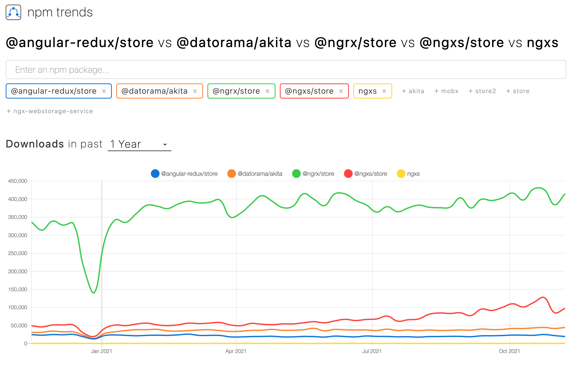

---
lang: he
dir: rtl
title: ngRx
to: revealjs
number-sections: true
output:
  html_document:
    template: ../reveal-template.html
css: ../fix-rtl.css
fragmentInURL: true
history: true
slideNumber: \'c/t\'
...

# לו"ז

| נושא | שעה       |
| ---- | --------- |
| RxJS | 9:15-9:45 |

# RxJS

- הופך כל דבר ל-stream שנקרא observable
- מאפשר שימוש ב-design pattern ב-JS אבל יש Reactive Programming בכל שפה

## Observables

- יש cold observables שעבורם המידע נוצר בנפרד עבור כל subscriber
- יש hot observables שעבורם המידע נוצר רק פעם אחת והופץ לכל ה-subscribers
- אפשר להמיר subscriber בין cold ל-hot עם קריאה ל-`const hot = observable.publish()`{dir=ltr .ts} ואז `hot.connect()`{dir=ltr .ts} כדי להתחיל את זרימת המידע

## שיטות שימושיות

- יש `observer.map(fn)`{dir=ltr .ts} ו-`observer.scan(fn)`{dir=ltr .ts} שהן מקבילות ל-`array.map(fn)`{dir=ltr .ts} ו-`array.reduce(fn)`{dir=ltr .ts}
- יש `observer.debounce(ms)`{dir=ltr .ts} ו-`observer.throttle(ms)`{dir=ltr .ts} שהן נותנות ערכים כל `ms`{dir=;tr .ts} זמן במילי שניות כאשר `debounce` נותן רק את האחרון אחרי ו-`throttle` רק את הראשון לפני

## Subject

- יש Subject שמאפשר יצירת מידע דינמית ללא מידע "מקור"
- יש BehaviourSubject שמחזיר את הערכים שהופצו מתחילת הSubject אל כל מי שמתחבר כשמתחברים

## סרטון מסכם

- נעמיק בכמה [דוגמאות](https://www.youtube.com/watch?v=ewcoEYS85Co&t=8s)

# תרגיל

- [https://dashboard.nbshare.io/api/v1/apps/reddit](https://dashboard.nbshare.io/api/v1/apps/reddit)
- `npm i rxjs`
- לפתוח בקשת GET אל ה-API פעם ב2-שניות ל-10 שניות
- לפרסר את המידע
- להסיר את המידע שהוא עם הערות מתחת ל-3, `"sentiment"` שהוא לא `"Bullish"` ו-`"sentiment_score"` מעל 0.3. אם יש מתחת ל-3 תוצאות, לא להוציא ל-Observable
- להציג את ה-3 הראשונים

# ngRx

{height=475px}

## @ngrx/\*

- ב-@ngrx יש מימוש של Redux עבור Angular עם RxJS
- בספריית @ngrx/store יש את היכולות המרכזיות של ngrx עם actions, reducers ו-selectors
- בספריית @ngrx/effects יש את היכולות הנדרשות ליצור side-effects מ-actions
- בספריית @ngrx/router-store יש קוד לחבר בין @angular/router ל-@ngrx/store
- בספריית @ngrx/store-devtools יש את היכולת לחבר @ngrx/store ל-Redux DevTools

# תפיסת Redux

- יש Actions שהם אירועים איחודים שנוצרו ע"י פעילות של המשתמש, פעילות רשתית או שימוש ב-API של המכשיר
- יש Reducers שהם פונקציות טהורות שאליהם מכניסים מצב נתון של state ו-action שהתקבל ומוציאים state חדש (כלומר לא עורכים כי ה-state הוא Immutable)

## Action

```ts
interface Action {
  type: string
}
```

## Reducer

```ts
type Reducer<StateType, ActionType extends Action> = (
  StateType,
  ActionType
) => StateType
```

# @ngrx/store

- נראה מימוש של כל רכיב ב@ngrx/store

## Actions

```ts
import { createAction, props } from "@ngrx/store"

export const login = createAction(
  "[Login Page] Login",
  props<{ username: string; password: string }>()
)
```

## Action creators

```ts
import { login } from "./actions/loginAction"

onSubmit(username: string, password: string) {
  store.dispatch(login({ username: username, password: password }));
}
```

## Reducers

```ts
import { createReducer, on } from "@ngrx/store"

import { login } from "./actions/loginAction"

export const loginReducer = createReducer(
  initialState,
  on(login, (state, { firstName, lastName, email }) => ({
    ...state,
    firstName,
    lastName,
    email,
  }))
)
```

## Store

```ts
import { NgModule } from "@angular/core"
import { StoreModule } from "@ngrx/store"
import { reducer } from "./reducers/login.reducer"

@NgModule({
  imports: [StoreModule.forRoot({ game: reducer })],
})
export class AppModule {}
```

## Selectors

- שימו לב: הן חייבות להיות פונקציות טהורות
- ```ts
  import { createSelector } from "@ngrx/store"

  export interface LoginState {
    firstName: string
    lastName: string
    email: string
  }

  export interface AppState {
    login: LoginState
  }

  export const selectFeature = (state: AppState) =>
    state.login

  export const selectFirstName = createSelector(
    selectFeature,
    (state: LoginState) => state.firstName
  )
  ```

# תרגיל

1. תצרו פרויקט Angular חדש ע"י `npx @angular/cli@12 new` (Angular 13 עדיין לא נתמך ע"י ngrx, אפשר להשתמש ב-CSS רגיל ולהוסיף את ה-router)
2. תוסיפו את `@ngrx/store` ע"י `npx @angular/cli add @ngrx/store@latest`
3. תוסיפו את `@ngrx/schematics` ע"י `npx @angular/cli add @ngrx/schematics@latest`
4. תוסיפו את `@ngrx/store-devtools` ע"י `npx @angular/cli add @ngrx/store-devtools@latest`
5. תצרו קומפוננטה עבור ה-login כולל שלוש input אחד ל-`username` ואחד `password` ואחד ל-`submit` ותצרו action שהוא asynchronous ב-`@ngrx/store` עבור login כאשר success אמור להחזיר `firstName`, `lastName` ו-`email`
6. תבדוק ב-Redux DevTools כי ה-action הורץ בלחיצה על כפתור ה-submit

## Effects

- משתמשים ב-`@ngrx/effect`
- ```ts
  import { Injectable } from "@angular/core"
  import {
    Actions,
    createEffect,
    ofType,
  } from "@ngrx/effects"
  import { EMPTY } from "rxjs"
  import { map, mergeMap, catchError } from "rxjs/operators"
  import { MoviesService } from "./movies.service"

  @Injectable()
  export class MovieEffects {
    loadMovies$ = createEffect(() =>
      this.actions$.pipe(
        ofType("[Movies Page] Load Movies"),
        mergeMap(() =>
          this.moviesService.getAll().pipe(
            map((movies) => ({
              type: "[Movies API] Movies Loaded Success",
              payload: movies,
            })),
            catchError(() => EMPTY)
          )
        )
      )
    )

    constructor(
      private actions$: Actions,
      private moviesService: MoviesService
    ) {}
  }
  ```
